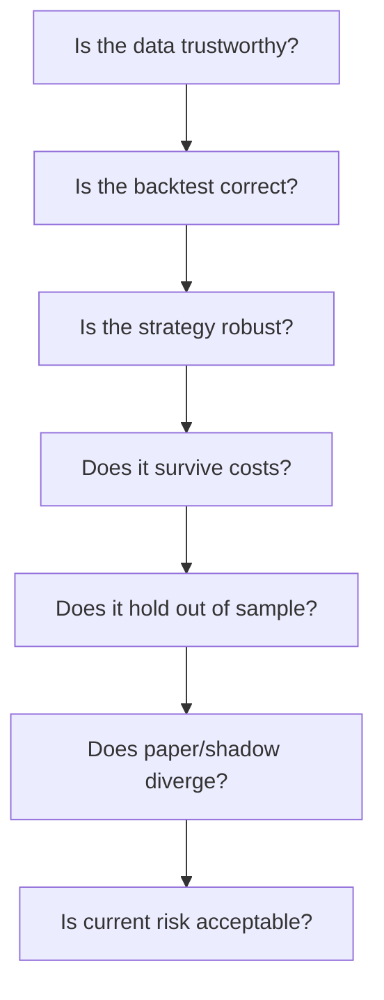

# TradeGuard

*[English](README.md) · [繁體中文](README.zh-TW.md)*

> **A falsifier for trading strategies, not a generator.**

Most backtesting tools are built to *run* a strategy. TradeGuard is built to
*reject* one — to make a dishonest result structurally hard to produce. Every
run is deterministic and checksummed, every unknown state fails closed, and
every promotion to a higher-consequence stage is an explicit human act.

It answers one question: **is this strategy worth trusting?**

---

## Status

```
R4 STRATEGY CANDIDATE / R3 CURRENT / NOT TRADABLE
```

Public `main` is at **R3 — fixed-order deterministic simulation** (promotion
record [`TG-R3-PROMOTION-2026-08-11`](docs/release/r3-promotion.md)). An R4
candidate — one trusted-local strategy protocol and one synthetic BTC-USD
buy-and-hold baseline — is implemented but `NOT_EVALUATED` and not promoted.

TradeGuard has **no live trading, no order submission, no withdrawal, and no
transfer capability**, and is not connected to any broker, exchange account, or
paid market-data service. Both connected market-data qualifications are
`BLOCKED` pending human review.

[`docs/status/implementation-matrix.md`](docs/status/implementation-matrix.md)
is the authority on what actually exists.

---

## Quickstart

Requires Python 3.12+ and [`uv`](https://docs.astral.sh/uv/). Everything below
runs fully offline against synthetic fixtures — no credentials, no network.

```bash
git clone https://github.com/EngelN9/TradeGuard.git
cd TradeGuard
uv sync --locked
```

### 1. Check whether a dataset can be trusted

```bash
uv run tradeguard data validate tests/fixtures/market_data/normal.json
```

```json
{
  "dataset_id": "synthetic-normal",
  "evaluated_at": "2024-01-02T00:06:00.000000Z",
  "issues": [],
  "manifest_checksum": "559e0e669ff3ab7d6bf37aaa192c8cba69c253361e2b640209320f5ffb0da750",
  "schema_version": "1.0.0",
  "status": "PASS"
}
```

Now try a dataset with a hole in it:

```bash
uv run tradeguard data validate tests/fixtures/market_data/gap.json
```

```json
{
  "dataset_id": "synthetic-gap",
  "issues": [
    {
      "code": "crypto_24_7_gap",
      "message": "crypto bar coverage has a 24/7 interval gap",
      "context": { "gap_seconds": 60 }
    }
  ],
  "status": "FAIL"
}
```

### 2. Run a deterministic backtest

Save this as `plan.json`:

```json
{
  "run_id": "00000000-0000-4000-8000-000000000060",
  "run_type": "backtest",
  "initial_cash": "100000",
  "base_currency": "USD",
  "orders": [
    {
      "order_id": "crypto-buy-1",
      "asset_class": "crypto",
      "venue": "SYNTH-CRYPTO",
      "symbol": "BTC-USD",
      "side": "buy",
      "order_type": "market",
      "quantity": "0.1000",
      "decision_event_time_utc": "2024-01-02T00:04:00Z",
      "submitted_at_utc": "2024-01-02T00:04:00Z",
      "sequence_number": 1
    }
  ]
}
```

Then run it:

```bash
uv run tradeguard backtest run tests/fixtures/market_data/normal.json plan.json result.json
uv run tradeguard backtest inspect result.json
```

```json
{
  "conserved": true,
  "fills": 1,
  "orders": 1,
  "result_checksum": "2aaa56590215d1e134e8985f0e7088e3c19500f0a0118714260d41eb5ffbe911",
  "run_type": "backtest",
  "warnings": ["crypto-buy-1: same-close fill rejected"]
}
```

Three things just happened that are the entire point of this project:

- **`conserved: true`** — cash and assets balance; the ledger cannot leak value.
- **`result_checksum`** — rerun the same command and you get the same hash.
- **`same-close fill rejected`** — the engine refused to fill an order at a
  price its own decision time could not have known. Look-ahead is not a warning
  you may ignore; the fill simply does not happen.

### 3. Watch it refuse bad input

```bash
uv run tradeguard backtest run tests/fixtures/market_data/gap.json plan.json out.json
```

```
ValidationEvidenceRejectedError: FAIL datasets cannot enter validation evidence
```

Exit code `1`. A dataset that failed its quality gate cannot become evidence.
This is the fail-closed rule, not an optional strictness setting.

> Without `uv`, see [`CONTRIBUTING.md`](CONTRIBUTING.md) for the equivalent
> virtualenv commands.

---

## What TradeGuard is

- A deterministic, reproducible backtest and replay engine.
- A data-quality and point-in-time gate that refuses untrustworthy input.
- A bias and leakage detector: look-ahead, same-close fills, contamination.
- A cost, slippage, and partial-fill stress harness.
- A staged promotion process where every step needs recorded human approval.

## What TradeGuard is not

- A profitable trading bot, or any claim that a strategy will make money.
- Investment advice, a managed account, or a signal-selling service.
- A broker, exchange, or custody platform.
- A low-latency or high-frequency execution engine.
- A system that lets an LLM make an authoritative financial decision.

---

## Why

A bot that can execute a strategy tells you nothing about whether the strategy
has positive expectancy. Good-looking backtests routinely come from:

- using data that was not knowable at the decision time;
- survivorship bias and missing delisted instruments;
- repeated tuning against the test set;
- ignoring fees, spread, slippage, and market impact;
- assuming every limit order fills;
- reading paper-trading results as achievable performance.

TradeGuard makes these failures visible instead of letting them pass silently:



Today the engine implements the first two boxes end to end. The rest are
staged, not implied — see the ladder below.

---

## Edge cases handled today

These are not aspirations. Each is a checked-in fixture with a deterministic
replay test in [`tests/fixtures/market_data/`](tests/fixtures/market_data/):

| Fixture | Scenario |
| --- | --- |
| `gap.json` | missing bars in a 24/7 crypto series |
| `out_of_order.json` | events arriving out of sequence |
| `duplicate.json` | repeated events that must not double-count |
| `stock_split.json` | equity split accounting |
| `delisting.json` | instrument removed mid-series |
| `crypto_maintenance.json` | venue maintenance window |
| `bad_tick.json` | implausible printed price |
| `stale_timestamp.json`, `fresh_timestamp_stale_content.json` | stale data that still *looks* fresh |

Every one of them makes the pipeline fail closed rather than produce a number.

---

## Current capability

| Domain | State |
| --- | --- |
| Domain events, configuration, run manifests | implemented |
| Canonical Decimal/UTC records, point-in-time metadata, lineage | implemented |
| Dataset manifests, content-addressed storage, quality gates | implemented |
| Equity adapter (Twelve Data, AAPL daily, offline) | implemented · connected use `BLOCKED` |
| Crypto adapter (Coinbase public, BTC-USD spot, offline) | implemented · connected use `BLOCKED` |
| Deterministic backtest/replay, Decimal ledger, conservative fills | implemented (R3) |
| Strategy protocol and one synthetic baseline | R4 candidate, `NOT_EVALUATED` |
| Strategy validation, walk-forward, risk engine, reporting | not started |
| Paper broker, shadow monitoring, reconciliation, alerting | skeleton or not started |

Per-domain stage caps live in
[`docs/roadmap/scope-ladder.md`](docs/roadmap/scope-ladder.md); exact status
lives in
[`docs/status/implementation-matrix.md`](docs/status/implementation-matrix.md).

---

## Safety boundary

Supported runtime environments are `research`, `backtest`, `replay`, `paper`,
and `shadow`. `canary` and `live` are rejected at configuration validation, and
any other value fails startup.

**No code path exists that can place an order, withdraw, or transfer funds.**
This is enforced by negative tests, not by policy alone.

Strategy code may only emit `Signal`, `TargetPosition`, or `TradeProposal`. It
cannot reach credentials, provider clients, risk configuration, or audit
stores. Any unknown, stale, or conflicting state fails closed.

Only public market-data, read-only, sandbox, or paper credentials are ever
permitted — never withdrawal, transfer, sub-account, or trading scope. Report
vulnerabilities privately per [`SECURITY.md`](SECURITY.md), never in a public
issue.

---

## Release ladder

TradeGuard has no single all-or-nothing MVP. **Every stop below is a legitimate
permanent product boundary** — usable, testable, maintainable, and safe to stop
at. An arrow is a separate decision, not an obligation.

| Stop | Outcome |
| --- | --- |
| R0 | Governance and safety baseline |
| R1 | Reproducible offline foundation |
| R2 | Restricted market-data contracts |
| **R3** | **Fixed-order deterministic simulation — current `main`** |
| R4 | One-strategy research slice *(candidate, awaiting human gate)* |
| R5 | Basic comparative and out-of-sample validation |
| R6 | Minimal independent risk engine |
| R7 | Reproducible research report and evidence |
| R8 | Internal deterministic paper broker |
| R9 | Read-only monitoring and reconciliation slice |
| R10 | Connected research release *(later, separate human gate)* |

Permanently excluded: live/canary trading, order submission, withdrawal,
transfer, custody, leverage, margin, shorting, derivatives, automatic
promotion, and profit guarantees.

Entry gates, evidence, rollback, and complexity budgets are in
[`docs/roadmap/release-ladder.md`](docs/roadmap/release-ladder.md).

---

## Stability and maintenance

- 253 offline tests, 90.10% coverage, deterministic result checksums.
- CI requires no credentials and no network access. Connected tests are
  separately opted in and report `SKIP` or `BLOCKED` when unrun — never `PASS`.
- Runtime dependencies are deliberately few: `fastapi`, `pydantic`, `pyyaml`,
  `uvicorn`, `websockets`.
- This is a single-maintainer project. Each ladder stop is designed to be
  **abandonable**: if development stops at R3, R3 remains a complete, working,
  documented tool rather than a half-built promise.

Performance is explicitly not a goal. TradeGuard is not a low-latency or
high-frequency engine and publishes no throughput benchmarks.

---

## Development

```bash
make setup      # uv sync --locked, npm ci, pre-commit
make lint       # ruff, workflow policy, secret scan
make typecheck  # mypy strict and tsc
make test       # offline suite with coverage floor
make dev-up     # local Compose stack
```

`make live` does not exist and must never be created. See
[`CONTRIBUTING.md`](CONTRIBUTING.md) for the full target list and the
no-Make / no-`uv` fallbacks.

Bugs and feature requests use the templates in
[`.github/ISSUE_TEMPLATE/`](.github/ISSUE_TEMPLATE/). Security issues go through
GitHub Private Vulnerability Reporting per [`SECURITY.md`](SECURITY.md).

---

## Documentation

| Question | Document |
| --- | --- |
| What may an AI coding agent do? | [`AGENTS.md`](AGENTS.md) |
| Full documentation map | [`docs/README.md`](docs/README.md) |
| Where is the project going next? | [`ROADMAP.md`](ROADMAP.md) |
| What is actually implemented? | [`docs/status/implementation-matrix.md`](docs/status/implementation-matrix.md) |
| How far may each domain expand? | [`docs/roadmap/scope-ladder.md`](docs/roadmap/scope-ladder.md) |
| What are the stable stopping points? | [`docs/roadmap/release-ladder.md`](docs/roadmap/release-ladder.md) |
| Data model, manifests, lineage, quality | [`docs/data/data-foundation.md`](docs/data/data-foundation.md) |
| Backtest ordering, ledger, fills, costs | [`docs/backtest/deterministic-engine.md`](docs/backtest/deterministic-engine.md) |
| Strategy boundary and fail-closed runner | [`docs/strategies/strategy-contract.md`](docs/strategies/strategy-contract.md) |
| Equity and crypto adapter specifications | [`docs/adapters/`](docs/adapters/) |
| R3 approval, evidence, rollback | [`docs/release/r3-promotion.md`](docs/release/r3-promotion.md) |

AI coding agents must follow [`AGENTS.md`](AGENTS.md). Scope a new increment
with [`docs/ai/claude-code-task-template.md`](docs/ai/claude-code-task-template.md)
or [`docs/ai/codex-task-template.md`](docs/ai/codex-task-template.md). Agents
must not add live trading, fabricate results, weaken risk limits, or approve
their own promotions.

---

## Known limitations

- Supported data sources are few and deliberately restricted.
- Cost and slippage models cannot fully reproduce real execution.
- Paper trading cannot reproduce queue position.
- Shadow monitoring does not mean a strategy is ready to trade.
- Statistical testing cannot remove all data-mining bias.
- Past and simulated performance does not predict future results.
- Users remain responsible for regulatory, tax, and data-licensing compliance
  in their own jurisdiction.

---

## Disclaimer

TradeGuard is software for engineering, quantitative research, education,
backtesting, paper trading, shadow monitoring, and risk analysis.

It is **not** investment advice and **not** a recommendation regarding any
security, futures contract, virtual asset, or other financial instrument. It
does not guarantee that any strategy is profitable, and historical or simulated
results may not be achievable in a real market. Backtest, paper, and shadow
results must never be described as realized performance.

Trading can cause partial or total loss of capital. Do not connect any account
without understanding the code, the strategy assumptions, and the risks, and
never with funds you cannot afford to lose. You assume all risk arising from
use of this software, its data, and its results.

---

## License

[Apache License 2.0](LICENSE). No commercial offering exists.

---

## Project principle

Success is not *finding the strategy with the highest backtested return*.

Success is *deciding, in a verifiable and reproducible way that does not mislead
the user, whether a strategy deserves further research, deserves paper trading,
deserves shadow monitoring, or should be stopped now.*

Any feature that improves none of research credibility, data integrity,
reproducibility, risk transparency, user safety, operational reliability,
auditability, or decision quality should be reconsidered.
