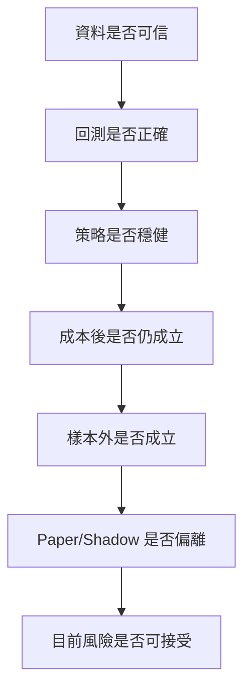

# TradeGuard

*[English](README.md) · [繁體中文](README.zh-TW.md)*

> **用來否證策略的工具，不是用來產生策略的工具。**

多數回測工具的目的是「把策略跑起來」。TradeGuard 的目的是「把策略駁回」——
讓不誠實的結果在結構上難以產生。每次執行都是確定性且帶 checksum 的，任何未知
狀態一律 fail closed，每一次晉級到後果更大的階段都必須是明確的人工行為。

它只回答一個問題：**這個策略值得信任嗎？**

---

## 專案狀態

```
R4 STRATEGY CANDIDATE / R3 CURRENT / NOT TRADABLE
```

公開 `main` 位於 **R3 — fixed-order deterministic simulation**（晉級紀錄
[`TG-R3-PROMOTION-2026-08-11`](docs/release/r3-promotion.md)）。R4 candidate
——一個 trusted-local strategy protocol 與一個 synthetic BTC-USD buy-and-hold
baseline——已實作，但狀態為 `NOT_EVALUATED`，尚未晉級。

TradeGuard **沒有 live 交易、沒有下單、沒有提款、沒有轉帳能力**，也未連接任何
券商、交易所帳戶或付費市場資料服務。兩項 connected 市場資料資格皆為 `BLOCKED`，
等待人工審查。

實際存在什麼，以
[`docs/status/implementation-matrix.md`](docs/status/implementation-matrix.md)
為準。

---

## 快速開始

需要 Python 3.12+ 與 [`uv`](https://docs.astral.sh/uv/)。以下全部在合成
fixture 上完全離線執行——不需要憑證，不需要網路。

```bash
git clone https://github.com/EngelN9/TradeGuard.git
cd TradeGuard
uv sync --locked
```

### 1. 檢查資料是否可信

```bash
uv run tradeguard data validate tests/fixtures/market_data/normal.json
```

```json
{
  "dataset_id": "synthetic-normal",
  "issues": [],
  "manifest_checksum": "559e0e669ff3ab7d6bf37aaa192c8cba69c253361e2b640209320f5ffb0da750",
  "status": "PASS"
}
```

換一份中間有缺口的資料：

```bash
uv run tradeguard data validate tests/fixtures/market_data/gap.json
```

```json
{
  "dataset_id": "synthetic-gap",
  "issues": [
    {
      "code": "crypto_24_7_gap",
      "message": "crypto bar coverage has a 24/7 interval gap",
      "context": { "gap_seconds": 60 }
    }
  ],
  "status": "FAIL"
}
```

### 2. 執行確定性回測

存成 `plan.json`：

```json
{
  "run_id": "00000000-0000-4000-8000-000000000060",
  "run_type": "backtest",
  "initial_cash": "100000",
  "base_currency": "USD",
  "orders": [
    {
      "order_id": "crypto-buy-1",
      "asset_class": "crypto",
      "venue": "SYNTH-CRYPTO",
      "symbol": "BTC-USD",
      "side": "buy",
      "order_type": "market",
      "quantity": "0.1000",
      "decision_event_time_utc": "2024-01-02T00:04:00Z",
      "submitted_at_utc": "2024-01-02T00:04:00Z",
      "sequence_number": 1
    }
  ]
}
```

執行：

```bash
uv run tradeguard backtest run tests/fixtures/market_data/normal.json plan.json result.json
uv run tradeguard backtest inspect result.json
```

```json
{
  "conserved": true,
  "fills": 1,
  "orders": 1,
  "result_checksum": "2aaa56590215d1e134e8985f0e7088e3c19500f0a0118714260d41eb5ffbe911",
  "run_type": "backtest",
  "warnings": ["crypto-buy-1: same-close fill rejected"]
}
```

這裡發生的三件事，正是整個專案的重點：

- **`conserved: true`** —— 現金與資產守恆，帳本不可能憑空生出價值。
- **`result_checksum`** —— 同樣指令再跑一次，會得到同一個 hash。
- **`same-close fill rejected`** —— 引擎拒絕以「該筆決策當下不可能知道的價格」
  成交。Look-ahead 不是一則可以忽略的警告，那筆成交根本不會發生。

### 3. 看它拒絕壞資料

```bash
uv run tradeguard backtest run tests/fixtures/market_data/gap.json plan.json out.json
```

```
ValidationEvidenceRejectedError: FAIL datasets cannot enter validation evidence
```

exit code `1`。未通過品質閘門的資料集不能成為證據。這是 fail-closed 規則，不是
一個可以關掉的嚴格模式。

> 沒有 `uv` 時，等價的 virtualenv 指令見
> [`CONTRIBUTING.md`](CONTRIBUTING.md)。

---

## TradeGuard 是

- 確定性、可重現的回測與 replay 引擎。
- 會拒絕不可信輸入的資料品質與 point-in-time 閘門。
- 偏誤與洩漏偵測器：look-ahead、same-close 成交、資料污染。
- 成本、滑價與部分成交的壓力測試平台。
- 每一步都需要人工核准紀錄的分階段晉級流程。

## TradeGuard 不是

- 保證獲利的交易機器人，也不宣稱任何策略會賺錢。
- 投資建議、代客操盤或訊號販售服務。
- 券商、交易所或資產保管平台。
- 低延遲或高頻交易引擎。
- 讓大型語言模型直接做出權威財務決策的系統。

---

## 為什麼需要它

一個能執行策略的機器人，完全不能說明該策略是否具有正期望值。看起來漂亮的回測
結果，經常來自：

- 使用決策當下不可能知道的資料；
- survivorship bias 與遺漏已下市標的；
- 對測試集反覆調參；
- 忽略手續費、spread、滑價與 market impact；
- 假設所有 limit order 都會成交；
- 把 paper trading 結果當成可實現績效。

TradeGuard 讓這些失敗顯性化，而不是讓它們靜默通過：



目前引擎完整實作了前兩個方塊。其餘為分階段規劃，並非既有能力——見下方階梯。

---

## 目前已處理的邊界情況

這些不是規劃，而是已納入版控的 fixture，每一個都有確定性 replay 測試，位於
[`tests/fixtures/market_data/`](tests/fixtures/market_data/)：

| Fixture | 情境 |
| --- | --- |
| `gap.json` | 24/7 加密貨幣序列中缺少 bar |
| `out_of_order.json` | 事件亂序抵達 |
| `duplicate.json` | 重複事件不得重複計入 |
| `stock_split.json` | 股票分割帳務 |
| `delisting.json` | 標的於序列中途下市 |
| `crypto_maintenance.json` | 交易所維護時段 |
| `bad_tick.json` | 不合理的成交價 |
| `stale_timestamp.json`、`fresh_timestamp_stale_content.json` | 看起來很新、實際過期的資料 |

每一種情況都會讓流程 fail closed，而不是產出一個數字。

---

## 目前能力

| 領域 | 狀態 |
| --- | --- |
| Domain events、設定、run manifest | 已實作 |
| Canonical Decimal/UTC 記錄、point-in-time metadata、lineage | 已實作 |
| Dataset manifest、content-addressed 儲存、品質閘門 | 已實作 |
| 股票 adapter（Twelve Data、AAPL 日線、離線） | 已實作 · connected 使用 `BLOCKED` |
| 加密貨幣 adapter（Coinbase 公開、BTC-USD 現貨、離線） | 已實作 · connected 使用 `BLOCKED` |
| 確定性回測/replay、Decimal 帳本、保守成交 | 已實作（R3） |
| Strategy protocol 與單一 synthetic baseline | R4 candidate，`NOT_EVALUATED` |
| 策略驗證、walk-forward、風險引擎、報告 | 尚未開始 |
| Paper broker、shadow 監控、對帳、告警 | 骨架或尚未開始 |

各領域的 stage 上限見
[`docs/roadmap/scope-ladder.md`](docs/roadmap/scope-ladder.md)；精確狀態見
[`docs/status/implementation-matrix.md`](docs/status/implementation-matrix.md)。

---

## 安全邊界

支援的執行環境為 `research`、`backtest`、`replay`、`paper` 與 `shadow`。
`canary` 與 `live` 會在設定驗證階段被拒絕，其他值一律啟動失敗。

**不存在任何可以下單、提款或轉帳的程式路徑。** 這由負向測試強制，而非僅靠政策。

策略程式碼只能產生 `Signal`、`TargetPosition` 或 `TradeProposal`，無法存取憑證、
provider client、風險設定或稽核儲存。任何未知、過期或衝突的狀態一律 fail closed。

只允許公開市場資料、唯讀、sandbox 或 paper 憑證——絕不允許提款、轉帳、子帳戶
或交易權限。安全問題請依 [`SECURITY.md`](SECURITY.md) 私密回報，不要開公開 issue。

---

## Release 階梯

TradeGuard 沒有單一的全有全無 MVP。**下列每一站都是合法的永久產品邊界**——
可用、可測試、可維護，且停在那裡是安全的。箭頭是獨立決策，不是義務。

| 停止點 | 產出 |
| --- | --- |
| R0 | 治理與安全基線 |
| R1 | 可重現的離線基礎 |
| R2 | 受限市場資料 contracts |
| **R3** | **Fixed-order deterministic simulation —— 目前 `main`** |
| R4 | 單一策略研究切片 *(candidate，等待人工 gate)* |
| R5 | 基本比較與樣本外驗證 |
| R6 | 最小獨立風險引擎 |
| R7 | 可重現研究報告與 evidence |
| R8 | 內部確定性 paper broker |
| R9 | 唯讀監控與對帳切片 |
| R10 | Connected research release *(較後期，獨立人工 gate)* |

永久排除：live/canary 交易、下單、提款、轉帳、資產保管、槓桿、保證金、放空、
衍生性商品、自動晉級與獲利保證。

各站的 entry gate、evidence、rollback 與複雜度預算見
[`docs/roadmap/release-ladder.md`](docs/roadmap/release-ladder.md)。

---

## 穩定性與維護

- 253 個離線測試、90.10% 覆蓋率、確定性結果 checksum。
- CI 不需要任何憑證與網路存取。Connected 測試需獨立 opt-in，未執行時回報
  `SKIP` 或 `BLOCKED`，絕不回報 `PASS`。
- 執行期依賴刻意維持精簡：`fastapi`、`pydantic`、`pyyaml`、`uvicorn`、
  `websockets`。
- 這是單一維護者專案。每個階梯停止點都設計成**可以被放棄**：即使開發停在 R3，
  R3 仍然是一個完整、可用、有文件的工具，而不是一個做到一半的承諾。

效能明確不是目標。TradeGuard 不是低延遲或高頻引擎，也不發布任何吞吐量 benchmark。

---

## 開發

```bash
make setup      # uv sync --locked、npm ci、pre-commit
make lint       # ruff、workflow 政策、secret 掃描
make typecheck  # mypy strict 與 tsc
make test       # 離線測試套件含覆蓋率門檻
make dev-up     # 本機 Compose stack
```

`make live` 不存在，也永遠不得建立。完整 target 清單與無 Make／無 `uv` 的替代
指令見 [`CONTRIBUTING.md`](CONTRIBUTING.md)。

問題回報與功能建議請使用
[`.github/ISSUE_TEMPLATE/`](.github/ISSUE_TEMPLATE/) 的模板。安全問題請依
[`SECURITY.md`](SECURITY.md) 走 GitHub Private Vulnerability Reporting。

---

## 文件

| 問題 | 文件 |
| --- | --- |
| AI 程式代理可以做什麼？ | [`AGENTS.md`](AGENTS.md) |
| 完整文件地圖 | [`docs/README.md`](docs/README.md) |
| 專案下一步是什麼？ | [`ROADMAP.md`](ROADMAP.md) |
| 實際實作了什麼？ | [`docs/status/implementation-matrix.md`](docs/status/implementation-matrix.md) |
| 各領域可擴張到哪一級？ | [`docs/roadmap/scope-ladder.md`](docs/roadmap/scope-ladder.md) |
| 穩定停止點有哪些？ | [`docs/roadmap/release-ladder.md`](docs/roadmap/release-ladder.md) |
| 資料模型、manifest、lineage、品質 | [`docs/data/data-foundation.md`](docs/data/data-foundation.md) |
| 回測排序、帳本、成交、成本 | [`docs/backtest/deterministic-engine.md`](docs/backtest/deterministic-engine.md) |
| 策略邊界與 fail-closed runner | [`docs/strategies/strategy-contract.md`](docs/strategies/strategy-contract.md) |
| 股票與加密貨幣 adapter 規格 | [`docs/adapters/`](docs/adapters/) |
| R3 核准、證據、rollback | [`docs/release/r3-promotion.md`](docs/release/r3-promotion.md) |

AI 程式代理必須遵守 [`AGENTS.md`](AGENTS.md)。新的單一增量任務請用
[`docs/ai/claude-code-task-template.md`](docs/ai/claude-code-task-template.md)
或 [`docs/ai/codex-task-template.md`](docs/ai/codex-task-template.md) 界定範圍。
代理不得新增 live 交易、捏造結果、放寬風險限制，或自行核准晉級。

---

## 已知限制

- 支援的資料來源少且刻意受限。
- 成本與滑價模型無法完全還原真實成交。
- Paper trading 無法重現 queue position。
- Shadow monitoring 不代表策略可以正式交易。
- 統計檢定無法消除所有資料探勘偏誤。
- 歷史與模擬績效不能預測未來結果。
- 使用者仍須自行確認所在司法管轄區的法規、稅務與資料授權要求。

---

## 免責聲明

TradeGuard 是用於軟體工程、量化研究、教育、回測、paper trading、shadow
monitoring 與風險分析的軟體。

它**不構成**投資建議，也**不構成**對任何證券、期貨、虛擬資產或其他金融商品的
推薦。它不保證任何策略獲利，歷史或模擬結果也未必能在真實市場實現。回測、paper
與 shadow 結果絕不得被描述為已實現績效。

市場交易可能造成部分或全部本金損失。在不了解程式碼、策略假設與風險的情況下，
請勿連接任何帳戶，也絕不應使用無法承受損失的資金。使用本軟體、其資料與其結果
所產生的風險，由使用者自行承擔。

---

## 授權

[Apache License 2.0](LICENSE)。目前不存在任何商業服務。

---

## 專案原則

成功的定義不是*找到回測報酬最高的策略*。

成功的定義是*以可驗證、可重現且不誤導使用者的方式，判斷一個策略應該繼續研究、
進入 paper trading、進入 shadow monitoring，還是現在就停止*。

任何新功能若無法改善研究可信度、資料完整性、可重現性、風險透明度、使用者安全、
維運可靠性、稽核能力或決策品質之中的至少一項，都應重新評估其必要性。
