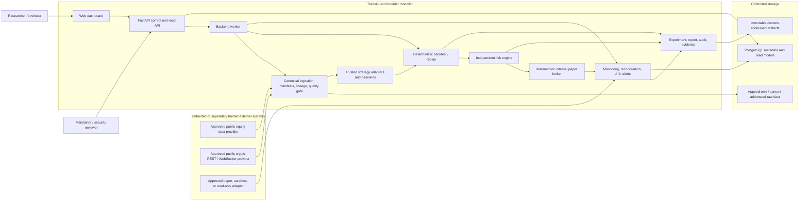
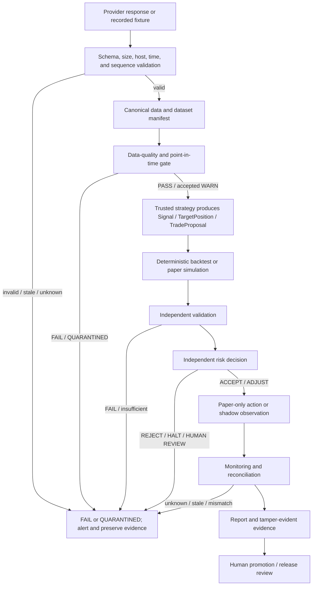
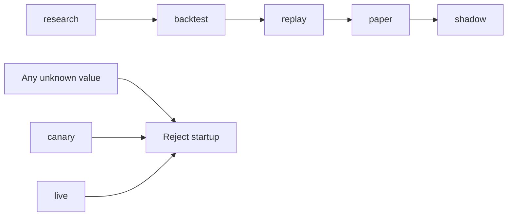

# TradeGuard v0.1.0 System Context

Status: `CURRENT TARGET ARCHITECTURE / PROGRESSIVELY IMPLEMENTED`

Scope: Connected research, backtest, replay, paper, and shadow monitoring

Maximum environment: `shadow`

## Mission and trust boundary

TradeGuard verifies whether market data, simulated execution, validation, and
risk evidence are trustworthy enough for research or a human-controlled
promotion decision. It does not predict guaranteed returns and it does not send
live orders.

The authoritative system is a modular backend. The dashboard is a read-oriented
view and control surface for bounded research/paper actions; it does not compute
authoritative risk, hold provider secrets, or call providers directly.

## Context diagram

External arrows into TradeGuard cross an untrusted-input boundary. Market data,
account snapshots, provider errors, request IDs, WebSocket sequences, and
timestamps require explicit schema and semantic validation. The external
non-live adapter is trusted only for the approved capability and endpoint; an
authenticated provider is not inherently trusted to be correct.

## Logical planes

### Research plane

- Content-addressed data ingestion and canonical normalization.
- Data-quality and point-in-time gates.
- Trusted strategy adapter execution.
- Deterministic backtest/replay, conservative fills, and separate market costs.
- Walk-forward, untouched out-of-sample validation, robustness, and risk.
- Experiment and report generation.

### Monitoring plane

- Paper/shadow event ingestion.
- Internal paper broker state and optional external non-live observations.
- Positions, balances, exposure, PnL, health, data freshness, and alerts.
- Reconciliation and drift.

### Control plane

- Effective configuration inspection.
- Environment and strategy-version visibility.
- Bounded research, backtest, validation, and paper start/stop actions.
- Human alert acknowledgement and promotion review.
- Append-only audit and evidence inspection.

The planes are logical modules in one deployable application for v0.1.0. They do
not justify separate microservices until an ADR documents a concrete scaling or
isolation need.

## Core flow and gates

No strategy has an edge that bypasses validation or risk. No gate failure is
converted to success by the dashboard. Unknown external order state is not
re-submitted automatically.

## Deployment context

The initial development deployment contains:

- FastAPI backend;
- background worker;
- PostgreSQL;
- deterministic mock market-data service;
- deterministic internal paper broker;
- dashboard;
- local content-addressed raw/artifact storage.

Containers run non-root, without a Docker socket, without embedded secrets, and
with read-only filesystems and reduced capabilities where feasible. Long-running
research and monitoring run in backend processes, not the browser.

## Data ownership

| Data | Authority | Required representation | Mutation policy |
| --- | --- | --- | --- |
| Raw provider response | Source adapter plus checksum | Original bytes and metadata | Append-only/content-addressed |
| Canonical market data | Versioned transformer | UTC, Decimal strings or explicit decimals | New version/lineage node |
| Effective config | Validated config resolver | Canonical redacted JSON and hash | Versioned, audited |
| Orders/fills/ledger | Backtest or paper engine | Decimal and immutable event identity | Append/replay; idempotent |
| Risk result | Independent risk engine | Versioned decision and reason | Append-only decision history |
| Reconciliation | Reconciliation engine | Five explicit states | New observation, never rewrite |
| Evidence | Evidence pipeline | SHA-256 indexed artifacts | Immutable after finalization |
| Dashboard view | Backend read model | Non-authoritative projection | Rebuildable |

## Environment boundary

The diagram shows supported capability progression, not automatic promotion.
Every promotion is evidence-backed and human-reviewed. `shadow` may consume
public market data and approved read-only account information but has no order
submission capability.

## Security boundaries

- Provider credentials, when eventually used, enter only a backend secret
  interface and never the repository, frontend, log, fixture, screenshot, or
  evidence bundle.
- Provider clients accept only approved HTTPS/WSS hosts. Redirects are limited
  or disabled and cloud metadata/private network destinations are rejected.
- Strategy code is trusted local code in v0.1.0. It receives declared data and a
  narrow output protocol, not provider clients, secrets, risk configuration, or
  database credentials.
- Default CI uses recorded fixtures and no connected secret.
- Connected tests are separately invoked, bounded, and truthfully record
  `PASS`, `FAIL`, or `BLOCKED`.
- Audit and evidence are append-only/content-addressed and verified by checksum.

## Failure behavior

TradeGuard fails closed when:

- data freshness, source agreement, timestamp, session, corporate action,
  precision, fee, manifest, config, strategy version, account state, or
  reproducibility is unknown;
- provider schema or sequence changes unexpectedly;
- risk configuration or risk evaluation fails;
- reconciliation is unknown, stale, unavailable, or mismatched;
- evidence checksums fail.

Fail closed means no new proposal that increases risk, no automated promotion,
an explicit unhealthy state, and preserved diagnostic evidence. It does not mean
deleting historical research or hiding an unfavorable result.

## Current implementation status

The diagram is the maximum modular-monolith context, not a claim that every box
exists. As of 2026-08-11:

- public `main` is Release Stop R3, promoted through merge `b92c8e9`, with
  domain/config/data foundations, restricted offline equity/crypto adapter
  contracts, fixed-order deterministic backtest/replay, Decimal ledger,
  conservative fills, separate costs, and the reviewed dashboard dependency
  security remediation;
- the human R3 `PASS` decision, exact reviewed head, evidence, conditions, and
  rollback are recorded in `docs/release/r3-promotion.md`;
- strategy, independent validation/risk, experiments/reports, paper state
  machine, monitoring/reconciliation/drift, and their full API/dashboard paths
  are target boxes only;
- connected qualifications are blocked/not opted in; no account or order path
  exists.

The exact reality is maintained in `docs/status/implementation-matrix.md`; stage
caps and stopping points are in `docs/roadmap/`.
