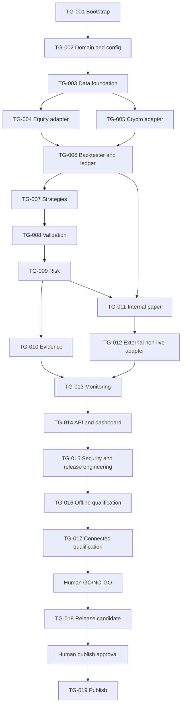

# TradeGuard Connected Release v1 Contract

Status: `APPROVED FOR IMPLEMENTATION`

Target version: `v0.1.0`

Assessment date: `2026-07-29`

Assessment base: `65d3c6f8499a189685c7c21e722c8ff6bf498cdb`

## 1. Release identity

The release name is **TradeGuard v0.1.0 Connected Research Release**.

This is a research, backtest, replay, paper, and shadow-monitoring release. It is
not a production trading system, does not provide investment advice, does not
guarantee profit, and must not be represented as capable of live trading.

The release contract was approved by maintainer `EngelN9` on `2026-07-29`.
Approval authorizes staged implementation through the mandatory review gates. It
does not authorize credentials, a release tag, a GitHub Release, or live trading.

## 2. Supported scope

### Markets

- High-liquidity US equities and ETFs, long-only and cash-only.
- High-liquidity cryptocurrency spot pairs, long/flat, unleveraged, with no
  lending, borrowing, futures, perpetuals, or options.
- Daily and minute-level research where the selected provider license and data
  capability permit it.

### Environments

The only valid runtime environments are:

- `research`
- `backtest`
- `replay`
- `paper`
- `shadow`

`research` is the default. Any other value fails configuration validation.
`canary` and `live` are prohibited and must not have configuration files,
commands, endpoints, order routes, or hidden aliases.

### Users

The v0.1.0 target is a single-user or trusted small-team research deployment.
Multi-tenancy, customer asset management, brokerage, custody, and advisory
workflows are out of scope.

## 3. Explicit non-goals

- Live, canary, leveraged, margin, short, derivatives, withdrawal, transfer, or
  sub-account management.
- Automated strategy promotion.
- Unreviewed strategy-package upload or execution.
- An in-process Python sandbox described as safe for arbitrary code.
- High-frequency or ultra-low-latency execution.
- Data redistribution not expressly allowed by the provider license.
- Profit claims, investment recommendations, or performance guarantees.
- A browser-only execution plane for long-running work.
- LLM-generated authoritative financial calculations or LLM-directed orders.

## 4. Required product capabilities

The release must include all of the following:

1. Versioned immutable domain events and deterministic canonical serialization.
2. Validated, redacted, versioned configuration with a deterministic hash.
3. Complete run manifests that record source, code, configuration, data,
   dependency, model, seed, and result identity.
4. Canonical equity and crypto schemas, content-addressed raw data, dataset
   manifests, lineage, and fail-closed data-quality gates.
5. One approved connected public equity market-data adapter.
6. One approved connected public crypto REST and WebSocket adapter.
7. Deterministic event-driven backtesting with conservative fills, separate
   equity and crypto costs, and Decimal authority boundaries.
8. Trusted baseline strategies used only to qualify the system.
9. Training, validation, test, untouched out-of-sample, walk-forward,
   robustness, multiple-testing, and leakage controls.
10. A strategy-independent risk engine that can accept, adjust, reject, halt,
    or require human review.
11. A deterministic internal paper broker and one approved external non-live
    adapter.
12. Paper/shadow monitoring, reconciliation, drift, health, and alerting.
13. Content-addressed experiments, reports, and tamper-evident evidence.
14. A FastAPI service, fixed OpenAPI snapshot, and read-oriented web dashboard.
15. Security, observability, backup/restore, release, rollback, SBOM, scans, and
    reproducibility qualification.

## 5. Required adapter contracts

All adapters must be provider-neutral at the domain boundary and declare their
capabilities. Every external endpoint must be allowlisted and TLS-verified.
Responses must be size-bounded and schema-validated. Retries must be bounded
with backoff. Unknown, stale, conflicting, or schema-invalid states fail closed.

The release requires:

- One public equity market-data adapter.
- One public crypto spot REST/WebSocket market-data adapter.
- One external paper, sandbox, or read-only account adapter.
- Recorded offline fixtures and contract tests for every adapter.
- Opt-in connected tests that never run in default CI or fork pull requests.

No adapter may:

- hold or request withdrawal, transfer, sub-account, or key-management scope;
- silently switch to a production trading endpoint;
- infer an unknown external order state as success;
- send an order to a live endpoint;
- expose credentials, account identifiers, or licensed raw responses in public
  evidence.

## 6. Adapter candidate decision matrix

The rows below are candidates, not approvals. Limits, availability, and terms
must be rechecked immediately before implementation and release.

### 6.1 Equity public market data

| Candidate | Credential | Free/test access | History / latest | Rate limit | License and redistribution | Python | Maintenance / region | Public CI fit |
| --- | --- | --- | --- | --- | --- | --- | --- | --- |
| [Alpha Vantage](https://www.alphavantage.co/documentation/) | API key; a documented demo key covers selected examples | Free key; premium features and freshness vary | Daily history is broad; intraday/full output and real-time entitlements vary by plan | Plan-dependent; throttling must be handled | Terms and exchange entitlements require review; commercial use requires a suitable plan | Plain HTTP; examples in Python | Mature HTTP API; quota and entitlement drift are material risks | Recorded fixtures: yes. Connected CI: opt-in only |
| [Twelve Data](https://twelvedata.com/docs/introduction/quickstart) | API key for REST and WebSocket | Basic plan is free with plan-defined credits and trial WebSocket symbols | Historical and latest equity time series; plan controls markets and real-time access | Credit-weighted, plan-dependent, `429` on exhaustion | Individual plans are scoped to personal/internal/non-commercial use; redistribution needs separate approval | Official Python SDK is documented, but a thin HTTP adapter is preferable | Maintained; country/market coverage and entitlement must be verified | Recorded fixtures: yes. Connected CI: opt-in only |
| [Alpaca Market Data](https://alpaca.markets/sdks/python/market_data.html) | Stock data requires API keys | Many market-data features and paper trading have free access | Historical bars, trades, quotes, and latest data; subscription/feed limits apply | Subscription-dependent | Market-data agreement and exchange entitlements require review; no public raw-data redistribution | Official `alpaca-py` | Strong Python support; account and regional eligibility add coupling | Recorded fixtures: yes. Connected CI: opt-in only |
| Stooq download | Usually no key for website downloads | Free web downloads are observable, but no stable provider contract has been approved | Useful end-of-day history; latest, calendar, and corporate-action semantics are unclear | Not contractually specified for this project | Terms and redistribution rights are insufficiently clear for release evidence | CSV only / community integrations | High schema, support, and licensing risk | Not recommended until written terms are verified |

### 6.2 Crypto public REST/WebSocket data

| Candidate | Credential | Free/test access | REST / WebSocket capability | Rate limit | License / region | Python | Maintenance risk | Public CI fit |
| --- | --- | --- | --- | --- | --- | --- | --- | --- |
| [Coinbase Advanced Trade public data](https://docs.cdp.coinbase.com/coinbase-app/advanced-trade-apis/rest-api) | Public REST and most market channels require no key | Public production market data; static sandbox exists for selected account/order schemas | Products, candles, books, trades; public ticker, level2, candles, trades, status, heartbeat channels | Endpoint limits apply and must be discovered/handled | Terms and geographic product availability require review | Plain HTTP/WebSocket; official samples | Version/schema evolution and 60–90 second idle-channel behavior require heartbeats | Good for opt-in smoke; offline fixtures remain default CI |
| [Binance Spot market-data-only](https://developers.binance.com/en/docs/products/spot/rest-api) | Public market data security type is `NONE` | Public market-data-only REST; Spot Testnet is separate | Exchange metadata, bars, trades, bid/ask, and streams | Weighted IP limits; `429`, `418`, and `Retry-After` semantics | Significant geographic/access restrictions; terms must be approved | Official/community connectors exist; thin client preferred | Endpoint availability by region and API-semantic drift | Opt-in only; may be BLOCKED by region |
| [Kraken Spot API](https://docs.kraken.com/) | Public market data requires no private key | Public REST and WebSocket | Pair metadata, OHLC, trades, book, ticker, status | Tiered endpoint/counter limits | Terms and regional availability require review | HTTP/WebSocket with official examples | Symbol aliases and version differences need strong normalization | Good for opt-in smoke; offline fixtures remain default CI |

### 6.3 Equity paper/read-only account integration

| Candidate | Credential scope | Free/test environment | Paper/read capability | Python | Maintenance / region | Public CI fit |
| --- | --- | --- | --- | --- | --- | --- |
| [Alpaca Paper](https://alpaca.markets/sdks/python/trading.html) | Dedicated paper keys; adapter must verify `paper=True` and endpoint | Paper environment is documented as free | Paper orders, positions, account state, fills | Official `alpaca-py` | Account and regional eligibility; production and paper keys must never be interchangeable | Recorded contracts in CI; connected opt-in with paper-only key |
| [Tradier Sandbox](https://docs.tradier.com/docs/endpoints) | Dedicated sandbox bearer token | Sandbox provides paper trading and delayed data | Account, order, position, and paper-trade APIs | Plain HTTP; community clients exist | Brokerage-account eligibility and US-market focus | Recorded contracts in CI; connected opt-in with sandbox URL allowlist |
| [IBKR Paper / read-only](https://www.interactivebrokers.com/docs/tws-api/doc/notes-limitations/limitations/paper-trading) | Paper account or read-only Web API session; production trading session forbidden | Paper account generally follows approved/funded account setup | Broad paper and account APIs, with documented simulation differences | Official TWS API supports Python | Highest operational complexity; gateway/session and regional/account prerequisites | Poor for public CI; suitable only as optional maintainer smoke |

### 6.4 Crypto sandbox/read-only account integration

| Candidate | Credential scope | Free/test environment | Paper/read capability | Python | Maintenance / region | Public CI fit |
| --- | --- | --- | --- | --- | --- | --- |
| Binance Spot Testnet | Testnet-only keys; production base URLs rejected | Virtual spot testnet | Sandbox orders and account state; testnet resets/feature differences expected | Official/community connectors; thin client preferred | Geographic endpoint availability and environment confusion are key risks | Recorded contracts in CI; connected testnet smoke opt-in |
| [Coinbase Advanced Trade static sandbox](https://docs.cdp.coinbase.com/coinbase-app/advanced-trade-apis/sandbox) | No authentication for documented static sandbox | Static, predefined sandbox responses | Selected account and order schemas; not a realistic matching engine | Plain HTTP | Low operational risk, but weak behavioral qualification because responses are mocked | Strong schema-contract candidate; does not alone satisfy realistic paper qualification |
| [Coinbase view-only account](https://docs.cdp.coinbase.com/api-reference/advanced-trade-api/rest-api/data-api/get-api-key-permissions) | Must report `can_view=true`, `can_trade=false`, `can_transfer=false`; any broader key rejected | Real account, read-only | Accounts, orders, fills, portfolios, and market information | Plain HTTP; JWT signing required | Credential and regional availability; account data must be redacted from evidence | Never default CI; optional connected read-only smoke only |
| [Kraken read-only account](https://docs.kraken.com/api/docs/rest-api/get-api-key-info) | Query-only permissions; `modify-trades`, withdrawal, address, and transfer-like permissions rejected | Real account, read-only | Funds, ledger, and order/trade queries according to granted query scopes | Plain HTTP with signing | Nonce management, regional availability, and strict redaction required | Never default CI; optional connected read-only smoke only |

### 6.5 Decision criteria and provisional preference

No provider is approved. For human review, the lowest-coupling shortlist is:

- Equity data: Twelve Data or Alpha Vantage for a small opt-in connected sample,
  depending on accepted license and quota.
- Crypto data: Coinbase public REST/WebSocket, with Kraken as an alternate when
  regional availability or terms require it.
- External non-live adapter: Alpaca Paper or Tradier Sandbox for behavioral
  paper qualification; Coinbase static sandbox is useful for schema tests but
  is insufficient by itself.

Selection must be recorded by ADR amendment with:

- approved hostnames and environment endpoints;
- terms/plan reviewed and reviewer/date;
- allowed evidence retention and redistribution;
- symbols and observation windows;
- required credential scope;
- connected-test owner;
- regional eligibility;
- fallback policy, which must be explicit and never automatic.

## 7. Offline CI contract

Default CI must require no external secret and no network access after dependency
installation. It must run:

- format check;
- lint;
- static type checking;
- unit, property, integration, contract, replay, E2E, and security tests;
- migration validation;
- OpenAPI snapshot comparison;
- secret, dependency, workflow-permission, license, and container scans;
- package, dashboard, and container builds;
- SBOM generation;
- evidence index and tamper verification.

All third-party GitHub Actions must be pinned to full commit SHAs. Workflow
permissions default to `contents: read`. Untrusted pull requests must not receive
secrets and must not execute through a privileged `pull_request_target` path.

## 8. Opt-in connected-test contract

Connected tests:

- use a separate marker and explicit opt-in switch;
- skip safely when prerequisites are absent;
- never silently use a production trading endpoint;
- use only public, data-only, paper-only, sandbox-only, or verified read-only
  credentials;
- are disabled for forks and default CI;
- have strict host allowlists, timeouts, response-size limits, bounded retries,
  rate-limit handling, observation windows, and clean shutdown;
- log provider request IDs and checksums, never raw secrets or account identity;
- record `PASS`, `FAIL`, or `BLOCKED`; unexecuted is never `PASS`;
- retain only license-compatible fixtures and redact all evidence.

## 9. Security gates

The release is `NO-GO` if any of the following is true:

- a real secret, account identifier, or licensed private payload is committed;
- a live, withdrawal, transfer, leverage, borrowing, or credential-management
  path exists;
- an adapter accepts an endpoint outside its environment allowlist;
- strategy output can bypass risk evaluation;
- unknown external order state triggers an automatic resubmission;
- reconciliation mismatch is displayed as healthy;
- secret redaction or evidence tamper detection fails;
- an unresolved Critical or High security issue exists;
- GitHub Actions expose secrets to untrusted code;
- untrusted strategy execution is described as safely sandboxed without
  process/container isolation evidence.

## 10. Reproducibility gates

- A fresh clone installs from a committed lockfile.
- Two clean, isolated environments use the same Git SHA, dependency lock,
  effective config, dataset manifests, and random seed.
- Canonical data, config, strategy version, order/fill/position ledgers, PnL,
  metrics, validation, risk, report, and evidence checksums match exactly unless
  a documented numerical tolerance applies.
- Run manifests are complete and mark dirty worktrees.
- Dirty-worktree results are rejected from release evidence.
- All time is timezone-aware UTC and all authoritative financial values use
  `Decimal` or explicit database decimal types.

## 11. Data-quality gates

- Raw data is append-only or content-addressed.
- Dataset manifest checksums and lineage verify.
- Provider responses pass schema and response-size validation.
- Missing, duplicate, unordered, future, stale-content, invalid OHLC, negative
  volume, abnormal jump, symbol conflict, and asset-specific checks execute.
- Equity point-in-time universe, session, corporate action, split, symbol
  change, and delisting controls pass.
- Crypto 24/7 gap, maintenance, sequence, precision, minimum-notional, crossed
  book, spread, and quote-asset controls pass.
- `FAIL` or `QUARANTINED` data cannot enter validation or release evidence.

## 12. Validation gates

- Training, validation, test, and untouched out-of-sample intervals are
  immutable and separately manifested.
- Look-ahead, label/feature leakage, future-universe leakage, and repeated
  tuning on test data are rejected.
- Benchmarks, walk-forward splits, cost and slippage sensitivity, parameter and
  date sensitivity, missing-data stress, regimes, and multiple-testing warnings
  are present.
- `FAIL` and `INSUFFICIENT_EVIDENCE` cannot promote to paper.
- Promotion is a human decision and never an automated side effect.

## 13. Risk gates

- Risk evaluation is independent from strategy code.
- Stale data, unknown session/account state, invalid precision, reconciliation
  uncertainty, or invalid risk configuration cannot increase risk.
- Exposure, capital, turnover, concentration, venue, quote asset, liquidity,
  participation, drawdown, and minimum-notional limits pass property tests.
- Equity gap/halt/crash and crypto venue/depeg/spread scenarios are recorded.
- Risk-limit configuration is versioned, hashed, audited, and fail closed.

## 14. API and dashboard gates

- OpenAPI matches implementation and is stored as a versioned snapshot.
- Writes are schema-validated, authenticated where applicable, authorized,
  audited, and idempotent where applicable.
- No live-order, withdrawal, transfer, risk-bypass, or audit-deletion endpoint
  exists.
- Every page shows the exact supported environment.
- Backtest, paper, and shadow are never labeled live.
- Unknown, stale, unavailable, failed, and quarantined states remain visible.
- Contract, authorization, responsive, accessibility, and E2E tests pass.

## 15. Release artifacts

The candidate must include:

- source archive;
- Python package or application bundle;
- container image metadata;
- dashboard build metadata;
- `uv.lock` and dependency-lock checksum;
- OpenAPI snapshot;
- database migration revision;
- SBOM and license inventory;
- dependency, secret, workflow, and container scan results;
- checksums for every released artifact;
- provenance metadata where supported;
- release notes, known limitations, upgrade, and rollback instructions;
- `RELEASE_MANIFEST.json`.

## 16. Evidence bundle

The root is:

```text
artifacts/evidence/v0.1.0/
├── index.json
├── README.md
├── build/
├── tests/
├── data/
├── backtests/
├── validation/
├── risk/
├── adapters/
├── api/
├── dashboard/
├── security/
├── reproducibility/
├── sbom/
└── release/
```

The index records path, artifact type, SHA-256 checksum, producer, run ID, Git
SHA, creation time, and validation status. Evidence is content-addressed,
immutable after finalization, path-traversal safe, redacted, and verified before
qualification. Missing, blocked, or failed evidence remains explicit.

## 17. Rollback contract

Rollback is required when:

- any non-waivable gate is later found invalid;
- an artifact, evidence index, dataset, or release checksum does not verify;
- a secret or private account datum is found;
- a live or over-privileged capability is discovered;
- migration, startup, health, or fresh-install checks fail;
- a connected provider changes schema, endpoint semantics, entitlement, or
  license in a way that invalidates evidence;
- a Critical/High security issue affects a reachable path.

Rollback means disabling affected connected adapters, withdrawing or marking the
release deprecated as appropriate, preserving evidence, documenting impact, and
returning users to the last verified version. It never enables a fallback live
endpoint and never deletes adverse evidence.

## 18. Human decision record

Decision owner: `EngelN9`

Decision date: `2026-07-29`

Review trigger: before each mandatory human gate and whenever provider terms,
regional availability, permissions, or endpoints change.

- [x] `v0.1.0` scope and supported markets approved as written.
- [x] Equity public-data provider: Twelve Data. Only data-only credentials are
      allowed; connected tests remain opt-in and license-compatible fixtures are
      required for public CI.
- [x] Crypto REST/WebSocket provider: Coinbase Advanced Trade public endpoints.
      Public channels are preferred; no private credential is required for the
      market-data adapter.
- [x] External non-live adapter: Coinbase Advanced Trade static sandbox. Its
      static behavior is a known limitation and does not replace the internal
      deterministic paper broker.
- [x] Credential and host policy approved: least privilege, explicit allowlists,
      no trading/transfer/withdrawal scope, and no silent fallback.
- [x] Public software license: Apache License 2.0.
- [x] Security reporting: GitHub Private Vulnerability Reporting.
- [x] Dashboard scope: trusted single-user deployment for v0.1.0.
- [x] Initial data, risk, security, release, and connected-test owner:
      `EngelN9`.

## 19. Work breakdown

Each issue below is independently reviewable. Every issue inherits the no-live,
no-secret, fail-closed, Decimal, UTC, test, evidence, and rollback requirements.

### TG-001 — Bootstrap typed repository and offline CI

- Purpose: create the reproducible Python, web, container, database, and CI
  skeleton.
- Scope: Prompt 1 only; tooling, health skeleton, mock services, evidence
  skeleton.
- Out of scope: domain logic, providers, strategies, trading.
- Dependencies: approved release contract and software license.
- Expected files: `pyproject.toml`, `uv.lock`, `Makefile`, `Dockerfile`,
  `docker-compose.yml`, `.github/`, `src/tradeguard/`, `web/`, `tests/`,
  `scripts/verify_clean_bootstrap.sh`.
- Acceptance/tests: fresh install; format, lint, typecheck, initial test suites;
  Compose health.
- Evidence: tool versions, lock hash, CI reports, container metadata.
- Security/rollback: minimal Actions permissions, fake `.env.example`; revert
  skeleton commit.
- Promotion gate: all Prompt 1 acceptance checks pass.

### TG-002 — Domain events, configuration, and run manifests

- Purpose: establish deterministic identity and safe configuration.
- Scope: immutable events, canonical JSON, hashes, redaction, allowed
  environments, run manifests, schemas.
- Out of scope: providers, strategy, execution.
- Dependencies: TG-001.
- Expected files: `src/tradeguard/domain/`, `config/`, `experiments/`,
  `configs/`, schema snapshots, unit/property tests.
- Acceptance/tests: stable serialization/checksum, naive-time rejection,
  redaction, environment rejection, dirty-worktree recording.
- Evidence: schema snapshots, sample manifest, checksum/redaction reports.
- Security/rollback: fail closed on invalid config; revert schema migration and
  preserve versioned parser compatibility.
- Promotion gate: Prompt 2 evidence complete.

### TG-003 — Canonical data, manifests, lineage, and quality gates

- Purpose: build provider-neutral point-in-time data foundations.
- Scope: canonical models, content-addressed storage, manifests, quality states,
  fixtures, CLI.
- Out of scope: network adapters.
- Dependencies: TG-002.
- Expected files: `src/tradeguard/data/`, `markets/`, fixture and quality tests,
  data docs.
- Acceptance/tests: all specified shared/equity/crypto failures; quarantined
  data cannot become validation evidence.
- Evidence: fixture manifests, reports, checksums, lineage.
- Security/rollback: raw input immutable; roll back transformers without
  rewriting raw data.
- Promotion gate: Prompt 3 plus human schema/PIT/license review.

### TG-004 — Equity connected public-data adapter

- Purpose: normalize one human-approved equity source.
- Scope: protocol, one adapter, capabilities, resilient client, fixtures,
  contract and opt-in smoke tests.
- Out of scope: broker orders and automatic provider fallback.
- Dependencies: TG-003 and recorded equity-provider approval.
- Expected files: `src/tradeguard/adapters/equity/`, contract fixtures/tests,
  `docs/adapters/equity-market-data.md`.
- Acceptance/tests: schema drift, timeout/rate limit, UTC, manifest, data quality,
  no-secret output.
- Evidence: capability, fixture checksum, contract and connected result.
- Security/rollback: hostname allowlist; disable adapter and retain offline
  fixtures.
- Promotion gate: Prompt 4 pass or connected smoke explicitly BLOCKED.

### TG-005 — Crypto connected REST/WebSocket adapter

- Purpose: normalize one human-approved crypto spot venue.
- Scope: REST, public WebSocket, metadata, heartbeat/reconnect/sequence handling,
  fixtures and opt-in smoke.
- Out of scope: private orders, futures, margin.
- Dependencies: TG-003 and recorded crypto-provider approval.
- Expected files: `src/tradeguard/adapters/crypto/`, contract/replay tests,
  `docs/adapters/crypto-market-data.md`.
- Acceptance/tests: missing sequence and stale stream become not-tradable;
  bounded reconnect and clean shutdown.
- Evidence: capabilities, REST/WS checksums, reconnect and rejection reports.
- Security/rollback: public endpoint allowlist; disable adapter, no fallback.
- Promotion gate: Prompt 5 pass or connected smoke explicitly BLOCKED.

### TG-006 — Deterministic backtester and ledger

- Purpose: produce conservative reproducible simulations.
- Scope: event loop, Decimal ledger, orders/fills, separate market costs,
  corporate actions, replay CLI.
- Out of scope: optimization and connected accounts.
- Dependencies: TG-004/TG-005 contracts and human interface review.
- Expected files: `src/tradeguard/backtest/`, `portfolio/`, `costs/`,
  `execution_models/`, unit/property/replay tests.
- Acceptance/tests: conservation, idempotency, look-ahead rejection, partial
  fills, split, maintenance, precision.
- Evidence: ledgers, manifests, deterministic checksums.
- Security/rollback: conservative defaults; revert model version while retaining
  old evidence.
- Promotion gate: Prompt 6 plus human ledger/fill/look-ahead review.

### TG-007 — Strategy protocol and trusted baselines

- Purpose: qualify the engine with transparent, non-promotional baselines.
- Scope: protocol, registry, six baselines, specifications, version hashing.
- Out of scope: arbitrary uploaded code and profitability claims.
- Dependencies: TG-006.
- Expected files: `src/tradeguard/strategies/`, strategy docs and contract tests.
- Acceptance/tests: declared-data enforcement, unsupported-market rejection,
  determinism.
- Evidence: contracts, manifests, version checksums.
- Security/rollback: trusted local allowlist only; unregister strategy version.
- Promotion gate: Prompt 7 pass.

### TG-008 — Validation and overfitting controls

- Purpose: prevent single-backtest and test-set-driven promotion.
- Scope: splits, walk-forward, leakage controls, sensitivity, bootstrap,
  multiple-testing tracking, reports/CLI.
- Out of scope: automatic promotion.
- Dependencies: TG-007.
- Expected files: `src/tradeguard/validation/`, fixtures, statistical docs/tests.
- Acceptance/tests: untouched OOS, deliberately overfit strategy rejection,
  cost/parameter sensitivity.
- Evidence: split, stability, warning, and rejection reports.
- Security/rollback: immutable split manifests; invalidate contaminated evidence.
- Promotion gate: Prompt 8 pass.

### TG-009 — Independent risk engine

- Purpose: make strategy proposals subordinate to versioned risk decisions.
- Scope: pre-trade research/paper checks, portfolio measures, stress scenarios,
  risk CLI and property tests.
- Out of scope: live limits or strategy-owned overrides.
- Dependencies: TG-008.
- Expected files: `src/tradeguard/risk/`, risk configs, scenario fixtures/tests.
- Acceptance/tests: no bypass, stale/unknown rejection, exposure consistency,
  monotonic scaling.
- Evidence: limit matrix, scenarios, property tests.
- Security/rollback: invalid config halts; restore prior signed/hashed limit
  version.
- Promotion gate: Prompt 9 plus human risk review.

### TG-010 — Experiment, report, and evidence pipeline

- Purpose: create complete, adverse-result-preserving research records.
- Scope: experiment model, immutable artifact store, reports, evidence CLI and
  tamper checks.
- Out of scope: mutable post-finalization editing.
- Dependencies: TG-009.
- Expected files: `src/tradeguard/experiments/`, `reports/`, evidence schemas and
  golden tests.
- Acceptance/tests: traversal rejection, checksum verification, tampering fail.
- Evidence: sample experiment/report/index.
- Security/rollback: quarantine corrupted store; rebuild only from verified
  sources.
- Promotion gate: Prompt 10 pass.

### TG-011 — Internal paper broker

- Purpose: provide deterministic non-live order lifecycle qualification.
- Scope: state machine, fills/cancel/expire/fault simulation, idempotency,
  restart/replay.
- Out of scope: any external or live endpoint.
- Dependencies: TG-006 and TG-009.
- Expected files: `src/tradeguard/paper/`, broker tests and fixtures.
- Acceptance/tests: duplicate prevention, UNKNOWN no-resubmit, restart recovery.
- Evidence: lifecycle and recovery reports.
- Security/rollback: halt on ambiguous state; replay verified ledger.
- Promotion gate: internal portion of Prompt 11 passes.

### TG-012 — Approved external non-live adapter

- Purpose: qualify a paper, sandbox, or read-only integration.
- Scope: one approved adapter, capability and permission checks, offline contract
  and opt-in smoke.
- Out of scope: production trading and over-privileged credentials.
- Dependencies: TG-011 and recorded provider/scope approval.
- Expected files: `src/tradeguard/adapters/accounts/`, fixtures, tests, runbook.
- Acceptance/tests: endpoint/env mismatch, excessive permission, retry,
  idempotency, unknown state.
- Evidence: capabilities, contract test, connected PASS/FAIL/BLOCKED.
- Security/rollback: revoke key and disable adapter; no secret retained.
- Promotion gate: Prompt 11 plus human credential/capability review.

### TG-013 — Monitoring, reconciliation, and drift

- Purpose: keep paper/shadow state visibly honest.
- Scope: ingestion, reconciliation states, drift types, alerts, replay, CLI.
- Out of scope: automatic risk increase or promotion.
- Dependencies: TG-010 to TG-012.
- Expected files: `src/tradeguard/monitoring/`, `reconciliation/`, replay tests.
- Acceptance/tests: mismatch/stale/version/cost/outage drills, critical block.
- Evidence: reconciliation, drift, alert, restart reports.
- Security/rollback: fail closed and preserve append-only events.
- Promotion gate: Prompt 12 pass.

### TG-014 — FastAPI and read-oriented dashboard

- Purpose: expose authoritative backend state without re-computation.
- Scope: required endpoints/pages, authz/audit for writes, OpenAPI snapshot,
  responsive/accessibility/E2E checks.
- Out of scope: live controls, secrets in frontend, frontend risk calculation.
- Dependencies: TG-013.
- Expected files: `src/tradeguard/api/`, `web/`, contract and E2E tests.
- Acceptance/tests: authorization, unknown/stale UI, environment labels,
  responsive and accessibility baseline.
- Evidence: OpenAPI, contract results, screenshots, E2E.
- Security/rollback: disable writes, serve verified read model.
- Promotion gate: Prompt 13 pass.

### TG-015 — Security, observability, database, and release engineering

- Purpose: harden the connected candidate and supply chain.
- Scope: threat model, logs/metrics/health, scans, SBOM, least privilege,
  backup/restore, secure container, builds.
- Out of scope: release tag.
- Dependencies: TG-014.
- Expected files: `docs/security/`, `docs/operations/`, `docs/release/`,
  observability, migrations, scripts, workflows.
- Acceptance/tests: security regressions, restore, package/container/dashboard
  builds and checksums.
- Evidence: scans, SBOM, restore proof, build metadata.
- Security/rollback: incident/rollback runbooks and adapter kill configuration.
- Promotion gate: Prompt 14 plus human security/supply-chain review.

### TG-016 — Offline qualification in two clean environments

- Purpose: prove fresh-clone and deterministic reproducibility.
- Scope: full offline matrix, failure drills, evidence index.
- Out of scope: connected claims and tags.
- Dependencies: TG-015.
- Expected files: `artifacts/evidence/v0.1.0/`, qualification scripts, readiness
  draft.
- Acceptance/tests: exact/tolerance comparison and all non-connected gates.
- Evidence: environment A/B and comparison records.
- Security/rollback: reject dirty or mismatched evidence.
- Promotion gate: offline portion of Prompt 15 passes.

### TG-017 — Connected end-to-end qualification

- Purpose: qualify approved equity, crypto, and external non-live adapters.
- Scope: bounded opt-in equity/crypto workflows and failure drills.
- Out of scope: tag, release, live credential.
- Dependencies: TG-016 and maintainer-provided minimal-scope prerequisites.
- Expected files: connected evidence and `docs/release/v0.1.0-readiness.md`.
- Acceptance/tests: connected results truthfully PASS/FAIL/BLOCKED; evidence
  complete; non-waivable gates pass.
- Evidence: observation windows, provider IDs, raw/normalized checksums, quality
  results.
- Security/rollback: revoke/disable connected credentials and adapters.
- Promotion gate: human GO/NO-GO after Prompt 15.

### TG-018 — Release candidate assembly

- Purpose: create reviewable v0.1.0 artifacts without publishing.
- Scope: docs, package/source/dashboard/container metadata, SBOM, checksums,
  manifest, tag and release drafts, smoke checks.
- Out of scope: creating/pushing a tag or GitHub Release.
- Dependencies: Prompt 15 GO and human evidence review.
- Expected files: `CHANGELOG.md`, `RELEASE_MANIFEST.json`, release docs/artifacts.
- Acceptance/tests: evidence, manifest, checksum, fresh install, migration,
  container/dashboard smoke.
- Evidence: complete candidate bundle.
- Security/rollback: discard candidate and fix source; never edit checksums to
  fit artifacts.
- Promotion gate: human review of Prompt 16 `READY_TO_TAG`.

### TG-019 — Publish v0.1.0

- Purpose: publish the human-approved commit and verified artifacts.
- Scope: annotated tag, tag push, GitHub Release, post-release verification.
- Out of scope: connected credential activation or long-running jobs.
- Dependencies: explicit human authorization after TG-018.
- Expected files: post-release verification document; GitHub tag/release.
- Acceptance/tests: tag SHA, asset checksums, install, startup, health,
  dashboard, offline sample.
- Evidence: GitHub release and post-release verification.
- Security/rollback: withdraw/deprecate failed release and preserve evidence.
- Promotion gate: `RELEASED` only if all post-release checks pass.

## 20. Dependency graph



## 21. Connected Release exit criteria

The contract exits Prompt 0 because:

- this contract, implementation matrix, context document, and ADR were reviewed;
- every external provider choice is recorded above;
- the public repository license and security contact have owners;
- the work breakdown was accepted;
- the repository remains planning/not tradable;
- no external connection, credential, runtime dependency, or application code
  was introduced by Prompt 0.

The first recommended implementation issue after approval is **TG-001 —
Bootstrap typed repository and offline CI**.
