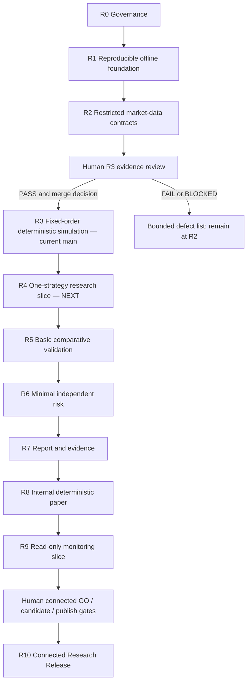

# Release and stable-stop ladder

Status: `NORMATIVE ROADMAP`

The ladder replaces the assumption that TradeGuard must implement every old
Prompt before it becomes maintainable. Each stop is independently usable,
testable, reversible, and safe to maintain for the long term.

Semantic version numbers and publication are human decisions. `R0`–`R10` are
planning IDs, not automatic tags.

## Repository reality as of 2026-08-11

- Public GitHub `main` includes R3 promotion merge `b92c8e9`: restricted
  offline market-data adapter contracts, fixed-order deterministic
  backtest/replay, Decimal ledger, conservative fills, separate costs, and the
  reviewed dashboard dependency security remediation. The current stable stop
  is **R3**.
- The human R3 decision is `PASS` and is recorded in
  `docs/release/r3-promotion.md`. R4 has not started and is the only `NEXT`
  implementation slice.
- Twelve Data and Coinbase connected qualification are both blocked/not opted
  in and are not release evidence.
- No strategy, independent risk engine, account adapter, order-submission path,
  or live capability exists.

## Stable stops

| Stop | Usable outcome and hard scope cap | Entry gate | Exit tests/evidence | Failure/rollback | Long-term maintenance and promotion |
| --- | --- | --- | --- | --- | --- |
| R0 — Governance baseline | Public safety boundary, license, private security reporting, status and ADR discipline; no application claim | Repository exists | Link/policy consistency, no placeholders/secrets | Revert docs; preserve accepted decision history | Maintain whenever scope/security contact changes; maintainer approves |
| R1 — Reproducible offline foundation | Locked typed project, domain/config/run manifests, synthetic data/manifests/quality, health and non-tradable UI skeleton; no provider/account action | R0 accepted | Ruff/mypy/offline tests, schema reproduction, clean bootstrap, secret/workflow checks | Revert last contract version; retain raw/evidence identity | Valid permanent educational/data-contract release; code/data owner approves |
| R2 — Restricted market-data contracts | R1 plus one narrow equity and one narrow crypto public-data adapter with sanitized offline contracts; connected claims remain blocked | Provider/terms/host decisions recorded | Offline contract/replay/schema/redaction tests; adapter ADRs; connected state truthfully `SKIP/BLOCKED` | Disable adapter, no fallback, retain adverse evidence | Recheck terms/endpoints; data/license owner promotes connected use separately |
| R3 — Fixed-order deterministic simulation **CURRENT on main** | R2 plus one offline bar backtester, Decimal cash/long ledger, conservative fills and separate costs; no strategies/metrics claims | R2 contracts stable; exact-head checks pass | Human review of ordering, conservation, same-close rejection, partial/non-fill, split, maintenance, costs; full offline suite; recorded `PASS` | Revert model version; preserve artifacts/checksums | Valid permanent simulation-core release; conditions and rollback in the R3 promotion record |
| R4 — One-strategy research slice **NEXT** | R3 plus trusted `StrategyProtocol`, one transparent buy-and-hold baseline for one market, deterministic strategy-to-order-to-result path; no registry framework or optimization | R3 promoted/merged; one exact market/fixture selected | Contract/declared-data/unsupported-market/version-hash/determinism tests and one clearly labeled synthetic report | Remove baseline/adapter; fixed-order R3 remains usable | Research owner maintains one specification; separate approval to add second market |
| R5 — Basic comparative validation | R4 plus cash/buy-and-hold benchmark, one immutable split and untouched OOS evaluation, one cost sensitivity; no walk-forward family or advanced overfitting statistics | R4 evidence stable and split declared before results | Split manifest, contamination rejection, benchmark and cost report, failed results visible | Invalidate contaminated validation; R4 remains usable | Valid permanent research-validation release; human research reviewer promotes |
| R6 — Minimal independent risk | R5 plus fail-closed stale/session/precision/notional, single-symbol/gross exposure and drawdown decisions; no portfolio optimizer | R5 validation contract stable; risk limits reviewed | Risk non-bypass, unknown-state rejection, exposure consistency and rollback tests | Restore prior hashed limits; halt proposals | Valid permanent risk-aware research release; human risk review required |
| R7 — Reproducible research report/evidence | R6 plus one finalized local experiment, balanced JSON/HTML report, generic evidence index/verify/tamper rejection; no database or remote store required | R6 output schemas stable | Golden report, checksum/tamper/path tests, manifest binding, adverse evidence retained | Quarantine corrupted store; rebuild from verified inputs | Candidate first public offline research release; release owner decides version/tag separately |
| R8 — Internal deterministic paper | R7 plus internal market-order paper state machine, idempotency, replay/restart and unknown-state halt; no external endpoint | R6 risk precedes action; state schema reviewed | Lifecycle, duplicate, restart, unknown-state, conservation and incident replay evidence | Stop broker, replay verified ledger, no auto-resubmit | Valid permanent paper-simulation release; paper and risk owners promote |
| R9 — Read-only monitoring slice | R8 plus five-state reconciliation and one bounded shadow/drift view using internal paper or one explicitly approved read-only source; no order submission | R8 stable; read-only permission/terms and runbook approved if external | Stale/mismatch/unavailable alerts, redaction, reconnect and recovery tests | Disable adapter/monitor; revoke key if any; retain mismatches | Conditional long-term stop while terms/owner/alerts remain current; security+risk approval |
| R10 — Connected Research Release | Aggregate approved v0.1.0 contract: qualified equity+crypto public data, one approved non-live/read-only integration, API/dashboard for implemented domains, security/observability/release evidence; still no live | R7–R9 applicable gates, connected opt-in approvals, two-environment offline qualification | Non-waivable gates in connected-release contract; redacted connected evidence; human GO and candidate verification | Disable integrations, revoke credentials, deprecate/withdraw candidate, preserve evidence | Optional later target; human GO, READY_TO_TAG, exact publish authorization required |

## Deferred and optional stops

The following are not prerequisites for R3–R10 unless an accepted RFC changes
the specific release contract:

- multiple baseline families, automatic parameter search, Monte Carlo suites,
  PBO/CPCV/Reality Check, factor optimization, and generalized plugin systems;
- multiple market-data, paper, or account providers;
- Freqtrade/Hummingbot bridges;
- multi-user administration, multi-tenancy, distributed workers, Kubernetes,
  high availability, remote experiment stores, or multi-platform releases;
- arbitrary untrusted strategy execution.

They remain `OPTIONAL` Stage 3/4 capabilities and must prove a need, owner,
budget, and rollback independently.

## Dependency graph



Every arrow is a separate task and promotion decision. R2, R3, R4, R5, R6,
R7, R8, and R9 are all valid terminal products; no arrow must be followed merely
because it is drawn.

## Permanently excluded from this ladder

- `canary` or `live` trading;
- production orders, withdrawal, transfer, custody, sub-account, or API-key
  management;
- leverage, margin, borrowing, shorting, futures, perpetuals, or options;
- automatic strategy/risk/release promotion;
- strategy access to secrets/providers/order APIs;
- mutable or fabricated research/release evidence;
- profit guarantees or investment advice.

## Immediate promotion sequence

```text
R3 main (stable; human promotion PASS recorded)
  -> R4 StrategyProtocol + one baseline (NEXT; separate future task)
```

R3 promotion does not authorize R4 implementation automatically. R4 requires
its own exact market/fixture selection, task scope, evidence, and human review.
